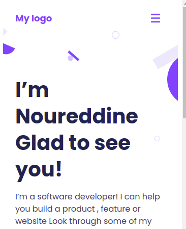
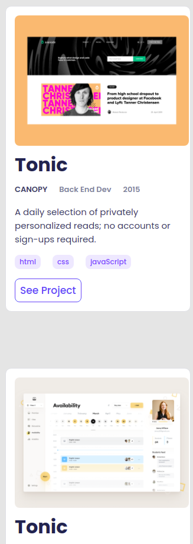

# Portfolio Sketlon Project Documentation

In this project I created a mobile version of a Portfolio integrating some features:

- A header with navigation bar and menu including a logo.
- A presentation section that provides general informations for the portfolio's owner.
- A section to show the projects created by the portfolio's owner.
- An about me section.
- Links to social networks accounts.
- A form to use to contact the portfolio owner.

## Built With

- HTML
- CSS
- VSCODE

## Live Demo

Not available yet

## Authors

👤 Noureddine MEZIANY

- GitHub: [@nmeziany](https://github.com/nmeziany)
- LinkedIn: [LinkedIn](https://www.linkedin.com/in/noureddine-meziany/)

## 🤝 Contributing

Contributions, issues, and feature requests are welcome!

Feel free to check the [issues page](../../issues/).

## Show your support

Give a ⭐️ if you like this project!

## Acknowledgments

- Hat tip to anyone whose code was used
- Inspiration
- etc

## 📝 License

This project is [MIT](./MIT.md) licensed.